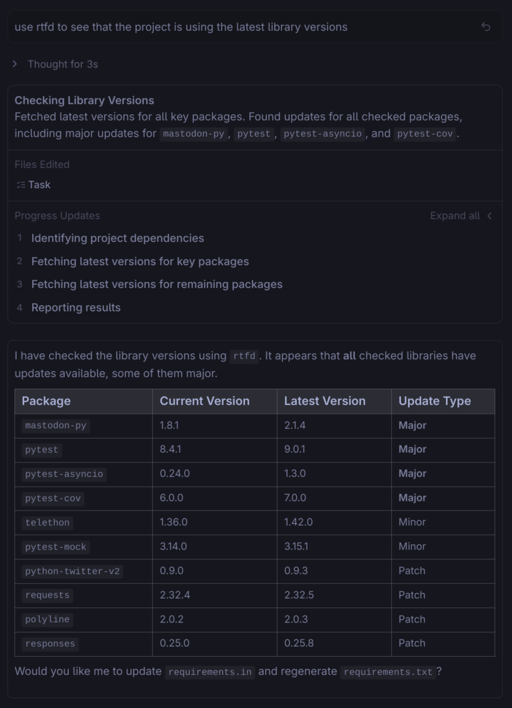

#  RTFD (Read The F*****g Docs) MCP Server

[](https://github.com/aserper/rtfd/actions/workflows/test.yml)
[](https://pypi.org/project/rtfd-mcp/)
[](https://www.python.org/downloads/)
[](LICENSE)

[](https://github.com/aserper/rtfd)
[](https://github.com/aserper/rtfd/fork)

The RTFD (Read The F*****g Docs) MCP Server acts as a bridge between Large Language Models (LLMs) and real-time documentation. It allows coding agents to query package repositories like PyPI, npm, crates.io, GoDocs, DockerHub, GitHub, and Google Cloud Platform (GCP) to retrieve the most up-to-date documentation and context.

This server solves a common problem where LLMs hallucinate APIs or provide outdated code examples because their training data is months or years old. By giving agents access to the actual documentation, RTFD ensures that generated code is accurate and follows current best practices.

## Why use RTFD?

*   **Accuracy:** Agents can access the latest documentation for libraries, ensuring they use the correct version-specific APIs and avoid deprecated methods.
*   **Context Awareness:** Instead of just getting a raw text dump, the server extracts key sections like installation instructions, quickstart guides, and API references, giving the agent exactly what it needs.
*   **Privacy:** Unlike cloud-based documentation services, RTFD runs entirely on your local machine. Your queries are sent DIRECTLY to the source (no servers in the middle, no API keys needed, etc) and the documentation you access never leave your system, ensuring complete privacy and no data collection.
*   **Supported Sources:** PyPI (Python), npm (JavaScript/TypeScript), crates.io (Rust), GoDocs (Go), Zig docs, DockerHub, GitHub repositories, and Google Cloud Platform (GCP). 

## Use Cases

RTFD helps in scenarios like:

- **Refactoring old code**: Fetch current `pandas` docs to find deprecated methods and their replacements. Instead of guessing what changed, the LLM reads the actual upgrade guide.

- **Unfamiliar libraries**: Integrating a Rust crate you've never seen? Look up the exact version, feature flags, and examples directly from the docs instead of guessing the API from general patterns.

- **Libraries after training cutoff**: Using a library released after the LLM's training data ends? Fetch the actual README and code examples from GitHub so the LLM can write correct usage instead of hallucinating APIs.

- **Docker optimization**: When optimizing a Dockerfile, inspect the official `python:3.11-slim` image to see exactly what packages and OS layers are included, rather than making assumptions.

- **Dependency audits**: Check PyPI, npm, and crates.io for available updates across all your dependencies. The LLM sees the latest versions and can generate an audit report without manually visiting each registry.



## Features

*   **Documentation Content Fetching:** Retrieve actual documentation content (README and key sections) from PyPI, npm, and GitHub rather than just URLs.
*   **Smart Section Extraction:** Automatically prioritizes and extracts relevant sections such as "Installation", "Usage", and "API Reference" to reduce noise.
*   **Format Conversion:** Automatically converts reStructuredText and HTML to Markdown for consistent formatting and easier consumption by LLMs.
*   **Multi-Source Search:** Aggregates results from PyPI, npm, crates.io, GoDocs, Zig docs, DockerHub, GitHub, and GCP.
*   **GitHub Repository Browsing:** Browse repository file trees (`list_repo_contents`, `get_repo_tree`) and read source code files (`get_file_content`) directly.
*   **PyPI Verification:** Optional security feature (`VERIFIED_BY_PYPI`) to ensure packages are verified by PyPI before fetching documentation.
*   **Smart GCP Search:** Hybrid search approach combining local service mapping with `cloud.google.com` search to find documentation for any Google Cloud service.
*   **Pluggable Architecture:** Easily add new documentation providers by creating a single provider module.
*   **Error Resilience:** Failures in one provider do not crash the server; the system is designed to degrade gracefully.

## Installation

### From PyPI (Recommended)

```bash
pip install rtfd-mcp
```

Or with `uv`:
```bash
uv pip install rtfd-mcp
```

### From source

Clone the repository and install:
```bash
git clone https://github.com/aserper/RTFD.git
cd RTFD
pip install .
# or: uv pip install -e .
```

## Quickstart

RTFD is an MCP server that needs to be configured in your AI agent of choice.

### 1. Install RTFD
```bash
pip install rtfd-mcp
# or with uv:
uv pip install rtfd-mcp
```

### 2. Configure your Agent

#### Claude Code
Run the following command to automatically add RTFD to your configuration:
```bash
claude mcp add rtfd -- command="rtfd" --env GITHUB_TOKEN=your_token_here --env RTFD_FETCH=true
```
Or manually edit `~/.claude.json`:
```json
{
  "mcpServers": {
    "rtfd": {
      "command": "rtfd",
      "env": {
        "GITHUB_TOKEN": "your_token_here",
        "RTFD_FETCH": "true"
      }
    }
  }
}
```

#### Cursor
1. Go to **Settings** > **Cursor Settings** > **MCP Servers**
2. Click **"Add new MCP server"**
3. Name: `rtfd`
4. Type: `stdio`
5. Command: `rtfd`
6. Add Environment Variable: `GITHUB_TOKEN` = `your_token_here`
7. Add Environment Variable: `RTFD_FETCH` = `true`

Or manually edit `~/.cursor/mcp.json`:
```json
{
  "mcpServers": {
    "rtfd": {
      "command": "rtfd",
      "env": {
        "GITHUB_TOKEN": "your_token_here",
        "RTFD_FETCH": "true"
      }
    }
  }
}
```

#### Windsurf
1. Open **Settings** > **Advanced Settings** > **Model Context Protocol**
2. Edit `~/.codeium/windsurf/mcp_config.json`:
```json
{
  "mcpServers": {
    "rtfd": {
      "command": "rtfd",
      "env": {
        "GITHUB_TOKEN": "your_token_here",
        "RTFD_FETCH": "true"
      }
    }
  }
}
```

#### Gemini CLI
Edit `~/.gemini/settings.json`:
```json
{
  "mcpServers": {
    "rtfd": {
      "command": "rtfd",
      "env": {
        "GITHUB_TOKEN": "your_token_here",
        "RTFD_FETCH": "true"
      }
    }
  }
}
```

#### Codex
Edit `~/.codex/config.toml`:
```toml
[mcpServers.rtfd]
command = "rtfd"
[mcpServers.rtfd.env]
GITHUB_TOKEN = "your_token_here"
RTFD_FETCH = "true"
```

### 3. Verify
Ask your agent: *"What tools do you have available?"* or *"Search for documentation on pandas"*.

## Configuration

RTFD can be configured using the following environment variables:

| Variable | Default | Description |
| :--- | :--- | :--- |
| `GITHUB_TOKEN` | `None` | GitHub API token. Highly recommended to increase rate limits (60 -> 5000 requests/hour). |
| `RTFD_FETCH` | `true` | Enable/disable content fetching tools. Set to `false` to only allow metadata lookups. |
| `RTFD_CACHE_ENABLED` | `true` | Enable/disable caching. Set to `false` to disable. |
| `RTFD_CACHE_TTL` | `604800` | Cache time-to-live in seconds (default: 1 week). |
| `RTFD_TRACK_TOKENS` | `false` | Enable/disable token usage statistics in tool response metadata. |
| `VERIFIED_BY_PYPI` | `false` | If `true`, only allows fetching documentation for packages verified by PyPI. |

## Releases & Versioning

For maintainers, see [CONTRIBUTING.md](CONTRIBUTING.md) for the automated release process.

## Available Tools

All tool responses are returned in JSON format.

### Aggregator
*   `search_library_docs(library, limit=5)`: Combined lookup across all providers (PyPI, npm, crates.io, GoDocs, GCP, GitHub). Note: Zig and DockerHub are accessed via dedicated tools.

### Cache Management
*   `get_cache_info()`: Get cache statistics including entry count, database size, and location.
*   `get_cache_entries()`: Get detailed information about all cached items including age, size, and content preview.

### Documentation Content Fetching
*   `fetch_pypi_docs(package, max_bytes=20480)`: Fetch Python package documentation from PyPI.
*   `fetch_npm_docs(package, max_bytes=20480)`: Fetch npm package documentation.
*   `fetch_godocs_docs(package, max_bytes=20480)`: Fetch Go package documentation from godocs.io (e.g., 'github.com/gorilla/mux').
*   `fetch_gcp_service_docs(service, max_bytes=20480)`: Fetch Google Cloud Platform service documentation from docs.cloud.google.com (e.g., "storage", "compute", "bigquery").
*   `fetch_github_readme(repo, max_bytes=20480)`: Fetch README from a GitHub repository (format: "owner/repo").
*   `fetch_docker_image_docs(image, max_bytes=20480)`: Fetch Docker image documentation and description from DockerHub (e.g., "nginx", "postgres", "user/image").
*   `fetch_dockerfile(image)`: Fetch the Dockerfile for a Docker image by parsing its description for GitHub links (best-effort).

### Metadata Providers
*   `pypi_metadata(package)`: Fetch Python package metadata.
*   `npm_metadata(package)`: Fetch JavaScript package metadata.
*   `crates_metadata(crate)`: Get Rust crate metadata.
*   `search_crates(query, limit=5)`: Search Rust crates.
*   `godocs_metadata(package)`: Retrieve Go package documentation.
*   `search_gcp_services(query, limit=5)`: Search Google Cloud Platform services by name or keyword (e.g., "storage", "compute", "bigquery").
*   `zig_docs(query)`: Search Zig documentation.
*   `docker_image_metadata(image)`: Get DockerHub Docker image metadata (stars, pulls, description, etc.).
*   `search_docker_images(query, limit=5)`: Search for Docker images on DockerHub.
*   `github_repo_search(query, limit=5, language="Python")`: Search GitHub repositories.
*   `github_code_search(query, repo=None, limit=5)`: Search code on GitHub.
*   `list_repo_contents(repo, path="")`: List contents of a directory in a GitHub repository (format: "owner/repo").
*   `get_file_content(repo, path, max_bytes=102400)`: Get content of a specific file from a GitHub repository.
*   `get_repo_tree(repo, recursive=False, max_items=1000)`: Get the complete file tree of a GitHub repository.

## Integration with Claude Code

Add the following to your `~/.claude/settings.json`:

```json
{
  "mcpServers": {
    "rtfd": {
      "command": "rtfd",
      "type": "stdio"
    }
  }
}
```

Or with environment variables:

```json
{
  "mcpServers": {
    "rtfd": {
      "command": "bash",
      "args": ["-c", "export GITHUB_TOKEN=your_token_here && rtfd"],
      "type": "stdio"
    }
  }
}
```

## Pluggable Architecture

The RTFD server uses a modular architecture. Providers are located in `src/RTFD/providers/` and implement the `BaseProvider` interface. New providers are automatically discovered and registered upon server restart.

To add a custom provider, create a new file in the providers directory inheriting from `BaseProvider`, implement the required methods, and the server will pick it up automatically.

## Provider-Specific Notes

### GCP (Google Cloud Platform)
*   **Service Discovery:** Uses a local service mapping (20+ common services), direct search on `cloud.google.com` (for general queries), and GitHub API search of the googleapis/googleapis repository.
*   **Documentation Source:** Fetches documentation by scraping docs.cloud.google.com and converting to Markdown.
*   **GitHub Token:** Optional but recommended. Without a `GITHUB_TOKEN`, GitHub API search is limited to 60 requests/hour. With a token, the limit increases to 5,000 requests/hour.
*   **Supported Services:** Cloud Storage, Compute Engine, BigQuery, Cloud Functions, Cloud Run, Pub/Sub, Firestore, GKE, App Engine, Cloud Vision, Cloud Speech, IAM, Secret Manager, and more.
*   **Service Name Formats:** Accepts various formats (e.g., "storage", "cloud storage", "Cloud Storage", "kubernetes", "k8s" for GKE).

### Other Providers
*   **Token Counting:** Disabled by default. Set `RTFD_TRACK_TOKENS=true` to see token stats in Claude Code logs.
*   **Rate Limiting:** The crates.io provider respects the 1 request/second limit.
*   **Dependencies:** `mcp`, `httpx`, `beautifulsoup4`, `markdownify`, `docutils`, `tiktoken`.

## Architecture

*   **Entry point:** `src/RTFD/server.py` contains the main search orchestration tool. Provider-specific tools are in `src/RTFD/providers/`.
*   **Framework:** Uses `mcp.server.fastmcp.FastMCP` to declare tools and run the server over stdio.
*   **HTTP layer:** `httpx.AsyncClient` with a shared `_http_client()` factory that applies timeouts, redirects, and user-agent headers.
*   **Data model:** Responses are plain dicts for easy serialization over MCP.
*   **Serialization:** Tool responses use `serialize_response_with_meta()` from `utils.py`.
*   **Token counting:** Optional token statistics in the `meta` field (disabled by default). Enable with `RTFD_TRACK_TOKENS=true`.

## Serialization and Token Counting

Tool responses are handled by `serialize_response_with_meta()` in `utils.py`:

*   **Token statistics:** When `RTFD_TRACK_TOKENS=true`, the response includes a `_meta` field with token counts (`tokens_json`, `tokens_sent`, `bytes_json`).
*   **Token counting:** Uses `tiktoken` library with `cl100k_base` encoding (compatible with Claude models).
*   **Zero-cost metadata:** Token statistics appear in the `_meta` field of `CallToolResult`, which is visible in Claude Code's special metadata logs but NOT sent to the LLM, costing 0 tokens.

## Extensibility & Development

### Adding Providers
The RTFD server uses a modular architecture. Providers are located in `src/RTFD/providers/` and implement the `BaseProvider` interface. New providers are automatically discovered and registered upon server restart.

To add a custom provider:
1.  Create a new file in `src/RTFD/providers/`.
2.  Define async functions decorated with `@mcp.tool()`.
3.  Ensure tools return `CallToolResult` using `serialize_response_with_meta(result_data)`.

### Development Notes
*   **Dependencies:** Declared in `pyproject.toml` (Python 3.10+).
*   **Testing:** Use `pytest` to run the test suite.
*   **Environment:** If you change environment-sensitive settings (e.g., `GITHUB_TOKEN`), restart the `rtfd` process.

